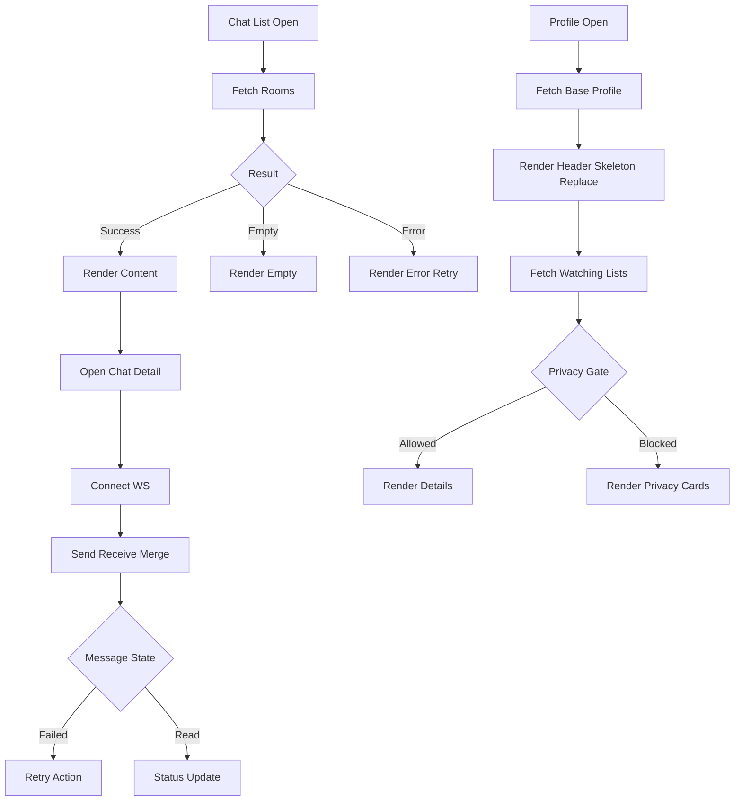

# Flutter UX Planı Chat önce User Profile

Bu plan kod değişikliği yapmadan hazırlanmıştır. İnceleme kaynakları:

- `lib/screens/chat_list_screen.dart`
- `lib/screens/chat_detail_screen.dart`
- `lib/screens/profile_screen.dart`
- `lib/screens/user_detail_screen.dart`
- `backend/controllers/http_helpers.go`
- `backend/controllers/chat_controller.go`
- `backend/controllers/user_controller.go`
- `backend/controllers/friend_controller.go`

## 1 Hedef ve kapsam

Öncelik sırası

1. Chat akışları
2. User Profile akışları
3. Backend hata sözleşmesi ile UI state eşleşmesi

Amaç

- Kritik edge case durumlarında kullanıcı belirsizliğini azaltmak
- Ağ ve gerçek zamanlı akışlarda tutarlı durum göstergeleri sağlamak
- API hata kodlarını kullanıcı diline ve aksiyonlarına net bağlamak

## 2 Chat akışları detay planı

### 2.1 Chat listesi deneyimi

Mevcut güçlü taraflar

- Arama modu var
- Okunmamış sayacı var
- Swipe ile yerel gizleme var
- Global socket rebind spamı için debounce yaklaşımı var

İyileştirme alanları

1. Loading Empty Error ayrımı net değil
2. Pull to refresh yok
3. Offline ve timeout durumlarında kalıcı uyarı yok
4. Swipe delete sonucu sunucu başarısızlığında geri alma yok
5. Online durumu her kartta true gösteriliyor

Önerilen UX davranışı

- Ekran state modeli
  - initial_loading
  - refresh_loading
  - empty
  - error_retryable
  - content
- Boş durumları ikiye ayır
  - hiç sohbet yok
  - arama sonucu yok
- Ağ hatasında üstte sabit non blocking banner
  - Bağlantı sorunu son veri gösteriliyor
- Swipe sonrası snackbar aksiyon
  - Geri al
- Okunmamış toplam badge üst bantta kalır ama erişilebilir metin eklenir

Kabul kriterleri

- Timeout veya hata aldığında liste kaybolmaz son başarılı veri kalır
- Kullanıcı tek dokunuşla yeniden dene yapabilir
- Silme sonrası 3 saniye içinde geri alma yapılabilir

### 2.2 Chat detay deneyimi

Mevcut güçlü taraflar

- Mesaj echo merge mantığı var
- Read receipt işleniyor
- Unmatch state mesaj inputu kapatıyor
- Hızlı mesajlar ilk mesaj için iyi bir onboarding

İyileştirme alanları

1. Gönderim state sent delivered read dışında failed yok
2. Yeniden gönder aksiyonu yok
3. Echo merge yalnız metin tabanlı eşleşmede yanlış merge riski taşıyor
4. Arkadaşlık durumu hem polling hem ws ile yönetiliyor gereksiz titreşim riski var
5. Unmatch block aksiyonlarının sonuç dili tutarsız

Önerilen UX davranışı

- Mesaj state makinesi
  - pending_local
  - sent
  - delivered
  - read
  - failed
- failed durumda balon altında mini aksiyon
  - Tekrar gönder
- Her local mesaja clientMessageId üret
  - Echo merge clientMessageId öncelikli
  - text fallback sadece geçici
- Friend status güncelleme stratejisi
  - ws event öncelikli
  - polling yalnız yedek ve daha seyrek
- Unmatch sonrası tek tip alt panel metni
  - Kim iptal etti bilgisi
  - Geri dönüş aksiyonu yok net son durum

Kabul kriterleri

- Ağ kesintisinde gönderilen mesaj failed olur ve tekrar gönderilebilir
- Aynı içerikli ardışık mesajlarda yanlış status merge oluşmaz
- Friend status butonunda durum sıçraması azalır

### 2.3 Chat etkileşim mikro metin standardı

Öneri

- Teknik hata metnini sadeleştir
  - İşlem tamamlanamadı tekrar dene
- Sunucu doğrulama metni
  - Mesaj boş olamaz
- Yetki hatası
  - Oturum süresi doldu tekrar giriş yap

## 3 User Profile akışları detay planı

### 3.1 Profile screen deneyimi

Mevcut güçlü taraflar

- Guest ve authenticated ayrımı net
- Profil header güçlü görsel kimlik taşıyor
- Ayarlar ve import giriş noktası mevcut

İyileştirme alanları

1. \_loadProfile içinde ardışık API çağrıları uzun bekleme yaratıyor
2. Favori poster fallback geç geliyor algısal zıplama yapabiliyor
3. Logout sonrası yönlendirme ve state temizliği daha deterministik olmalı
4. Watching bilgisi hata aldığında sessizce düşüyor kullanıcı ne olduğunu anlamıyor

Önerilen UX davranışı

- Aşamalı yükleme
  - Profil temel veri önce
  - Watching ve favori poster sonra
- Header skeleton ve shimmer
- Watching kartında stale badge
  - Son güncelleme bilgisi
- Logout sonrası tek akış
  - token temizle
  - root navigation reset

Kabul kriterleri

- Profil ilk render süresi hissedilir biçimde kısalır
- Yardımcı veriler geç gelse de ekran stabil kalır

### 3.2 User detail deneyimi

Mevcut güçlü taraflar

- Gizlilik kapısı canSeeProfileDetails ile düşünülmüş
- Edit mode ile açıklama avatar kapak güncelleniyor
- Letterboxd import preview ve strategy adımlı

İyileştirme alanları

1. \_fetchProfile içinde her liste için tek tek item çekimi yüksek gecikme yaratır
2. Header sayaçları statik 0 görünüyor güven düşürür
3. Edit mode toggle hem kaydet hem mod değişimi tek butonda karışık algı
4. Gizli profilde bazı bloklar görünür bazıları gizli parçalı deneyim
5. Import akışında uzun işlem için adım ilerleme görünümü yok

Önerilen UX davranışı

- Data orchestration
  - Liste özetleri önce
  - içerik lazy yükleme
- Header statları gerçek veriye bağlanmalı
  - eşleşme sayısı
  - sohbet sayısı
  - izleme sayısı
- Edit UX ayrımı
  - Düzenle
  - Değişiklikleri kaydet
  - İptal
- Gizlilikte tek kapı ilkesi
  - erişim yoksa tüm detay blokları tutarlı bilgilendirme kartlarıyla gösterilir
- Import wizard
  - Dosya seç
  - Önizleme
  - Strateji seç
  - İşleniyor
  - Sonuç

Kabul kriterleri

- Büyük listelerde ekran donmadan açılır
- Kullanıcı düzenleme modunda olduğunu net anlar
- Gizlilik kısıtı olan profilde çelişkili içerik görünmez

## 4 Backend API hata sözleşmesi ve Flutter state eşlemesi

Standart hata gövdesi hedefi

- code
- message
- detail

UI eşleme tablosu

- INVALID_BODY
  - Form doğrulama hatası göster input odağı ver
- UNAUTHORIZED
  - Oturum yenile veya giriş ekranına yönlendir
- FORBIDDEN
  - Bu işlem için yetkin yok bilgilendirmesi
- NOT_FOUND
  - İçerik bulunamadı boş durum kartı
- RATE_LIMITED
  - Kısa bekleme ve tekrar dene
- INTERNAL
  - Genel hata ekranı son veri korunur

Chat özel

- CHAT_ROOM_NOT_FOUND
  - Sohbet artık aktif değil listeye dön
- INVALID_TOKEN veya MISSING_TOKEN
  - ws yeniden kimlik doğrulama ve sessiz reconnect denemesi

User özel

- PROFILE_PRIVATE
  - Profil detayları gizli kartı
- IMPORT_PREVIEW_INVALID
  - Dosya formatı açıklaması ile tekrar seç

## 5 Önerilen uygulama sırası

1. UI state modeli ortaklaştır
2. Chat listesinde loading empty error refresh ayrıştır
3. Chat detail mesaj state makinesi ve retry
4. clientMessageId tabanlı echo merge
5. Friend status ws öncelik polling azaltma
6. Profile aşamalı yükleme ve skeleton
7. User detail lazy list loading ve gerçek header statları
8. Edit mode butonlarını ayır kaydet iptal
9. Import wizard ilerleme adımı
10. API error code to UI mapping katmanı

## 6 Mimari akış diyagramı

## 7 Test ve doğrulama senaryoları

Chat

- İnternet kapalıyken sohbet listesi açılışı
- Mesaj gönderirken bağlantı kopması
- Aynı metin art arda iki mesaj ve doğru status eşleşmesi
- Unmatch event sohbet açıkken gelmesi

User Profile

- Büyük liste sayısında profil açılış akıcılığı
- Gizli profilin arkadaş olmayan kullanıcıda görünümü
- Edit mode iptal ve kaydet davranışı
- Letterboxd bozuk dosya ve geçerli dosya akışı

## 8 Uygulama görev listesi Code moduna hazır

- Chat listesine state enum ve retry bileşeni ekle
- Swipe delete için undo snackbar ve sunucu başarısızlık rollback
- Chat detail mesaj modeline clientMessageId ve failed state ekle
- Mesaj balonuna retry UI ekle
- Friend status polling aralığını düşür ws event ile reconcile et
- Profile ekranında staged load ve skeleton uygula
- User detail list item çağrılarını batch veya lazy düzene çek
- Header statlarını backend verisiyle doldur
- Edit mode için ayrı kaydet iptal aksiyonları ekle
- ApiService hata code mapping yardımcı katmanı oluştur
